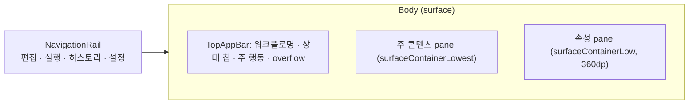

# 09. 디자인 개선 계획 (Material Design 3)

작성일: 2026-10-10 · 대상: `shared/src/commonMain/kotlin/aiflow/ui/**`, `desktopApp/Main.kt`
기준: Compose Multiplatform 1.10.3 / `androidx.compose.material3`

참고 자료
- M3 컴포넌트 선택 가이드: <https://m3.material.io/components>
- 버튼 위계(Filled / Tonal / Outlined / Text): <https://m3.material.io/components/all-buttons>
- Segmented button / Chips / Radio / Switch: <https://m3.material.io/components/segmented-buttons>, <https://m3.material.io/components/chips>
- Menus·Exposed dropdown: <https://m3.material.io/components/menus>
- Text fields: <https://m3.material.io/components/text-fields>
- Lists / Cards / Dividers: <https://m3.material.io/components/lists>, <https://m3.material.io/components/cards>
- Navigation rail: <https://m3.material.io/components/navigation-rail>
- Layout · panes · spacing: <https://m3.material.io/foundations/layout/understanding-layout>
- Color roles · surface containers: <https://m3.material.io/styles/color/roles>
- 기존 감사: [phase3-material3-audit.md](scripts/phase3-material3-audit.md) (실행 화면 한정)

---

## 1. 현황 진단

### 1.1 사용자 발견 항목

| # | 문제 | 근거 코드 | M3 원칙 위반 |
|---|---|---|---|
| A | **모든 선택 요소가 버튼** | `EditorChoice`가 `OutlinedButton` + `DropdownMenu` (EditorScreen.kt `EditorChoice`), 이슈/초안/버전/파일 목록이 `TextButton` 나열, 설정의 후보 경로 선택이 `OutlinedButton`, 전이 목록이 `OutlinedButton` | 버튼은 "행동(action)"용. 값 선택은 Menu/Select, 단일 선택은 Segmented button·Radio, 목록 항목은 List item을 사용해야 함 |
| B | **편집 반영 방식 불일치** | 이름·제목·브랜치 등은 입력 즉시 `editor.edit{}` 반영 / 단계 `id`는 "id 변경·참조 갱신", 워크트리·세션 `name`은 "이름 변경" 버튼 필요 / 전이 폼은 "적용·재연결" 버튼 필요 / 설정의 모델 후보는 "추가" 버튼 | 같은 모양(OutlinedTextField)이 서로 다른 커밋 규칙을 가짐 → 사용자가 반영 여부를 예측할 수 없음 (M3 Text fields: 상태·결과를 명확히) |
| C | **항목 나열·영역 구분 약함** | 모든 화면이 `Column(spacedBy 6~12dp)` 단일 스택, 섹션 제목은 `titleMedium` 텍스트 하나, 컨테이너 색 구분 없음. 에디터 상단 툴바 17개 요소가 `FlowRow`에 동일 간격으로 나열 | M3 레이아웃: pane·surface container 톤·그룹 간격(8/16/24dp)으로 위계 표현 |

### 1.2 추가 발견 항목

| # | 문제 | 위치 |
|---|---|---|
| D | 상단 툴바 과밀: 새로 만들기/열기/저장/버전/저장·실행/실행 화면으로/가져오기/내보내기/복제/삭제/실행 취소/다시 적용이 동일 레벨. Filled 버튼이 2개(저장, 저장·실행)라 주 행동이 불분명 | `EditorScreen` L78–94 |
| E | 아이콘 미사용. `☰`, `↑`, `↓`, `−`, `+`, `!`, `✓` 같은 문자로 대체 → 크기·정렬·접근성 라벨 불량 | 전 화면 |
| F | 테마 미정의: `MaterialTheme {}` 기본값 사용 (기본 보라 baseline, 라이트 고정, 다크 모드 미지원, 타이포·shape 미정의) | `App.kt` L25 |
| G | 저장소 경로 입력이 편집/실행 두 화면에 중복, 경로 입력은 텍스트만 지원(파일 선택기 없음, 실행 화면) | `EditorScreen` L30–38, `RunScreen` L65–70 |
| H | 상태 표시 혼재: `E3 / W1` 같은 축약 텍스트, `Severity.ERROR` enum 원문, `RunStatus`/`StepStatus` 영문 원문이 사용자에게 노출 | Editor L93, L155 / Run L132 / History L76 |
| I | 삭제 등 파괴적 행동이 `TextButton` 기본 색. 위험 색(error) 미사용 | Editor L90, L227, L295 / History L70 |
| J | 도움말 문구가 `bodySmall` 문단으로 상시 노출(예: "전이 command: 0=매칭 …") → 시각적 소음 | Editor L132, L246, L257 / Settings L52 |
| K | 오류 표시가 화면 상단 텍스트 한 줄 → 어떤 필드의 오류인지 연결 안 됨. 일부는 snackbar | Editor L37, L225 / Settings L21 |
| L | 다이얼로그 남용: 초안 열기, 버전 기록, 템플릿 선택이 AlertDialog 안의 TextButton 목록 | Editor L165–182 |
| M | 탭 레이블이 문자열 상수로 분기(`tab == "그래프"`) → 유지보수·번역 취약 | App, Editor |
| N | 키보드 흐름 미흡: Enter 커밋, Esc 취소, Undo/Redo(⌘Z/⇧⌘Z) 메뉴 단축키 없음 | Main.kt MenuBar |
| O | 빈 상태(empty state)가 문장 한 줄. 다음 행동 버튼 없음 | Editor L158, History L30, Run L91 |
| P | 히스토리 시도 상세가 `\n`으로 이어 붙인 단일 Text → 스캔 불가 | History L84 |

---

## 2. 설계 원칙

1. **역할에 맞는 컴포넌트** – 행동=Button, 값 선택=Menu/Segmented/Radio/Switch/Checkbox, 탐색=Tab/Rail, 항목=ListItem/Card.
2. **편집 커밋 규칙 하나로 통일** – "입력은 즉시 초안에 반영(undo 가능), 참조 무결성이 필요한 식별자는 포커스 이탈·Enter 시 검증 후 반영".
3. **영역은 Surface 톤으로 구분** – 배경 `surface`, 패널 `surfaceContainerLow`, 카드/섹션 `surfaceContainer`, 선택 `secondaryContainer`.
4. **주 행동은 화면당 1개** – Filled 1개, 보조 Tonal/Outlined, 나머지는 overflow 메뉴.
5. **텍스트보다 상태 시각화** – Badge, Assist chip, 아이콘+색+텍스트(색만으로 의미 전달 금지).

---

## 3. 개선 상세

### 3.1 [A] 선택 요소를 역할별 컴포넌트로 교체

| 현재 | 용도 | 변경 | M3 컴포넌트 (Compose) |
|---|---|---|---|
| `EditorChoice` (OutlinedButton "label: value") | 값 1개 선택 (세션, 조건, 대상, 완료 확인, workspace, provider, effort, 시작 단계) | 읽기전용 텍스트필드 + 트레일링 ▼ 메뉴 | `ExposedDropdownMenuBox` + `OutlinedTextField(readOnly)` + `ExposedDropdownMenu` |
| `EditorField("모델")` + `EditorChoice("후보 모델")` 2개 | 자유 입력 + 후보 | 하나로 통합: 입력 가능한 콤보박스 | `ExposedDropdownMenuBox` (editable, 입력값 필터) |
| `FilterChip` × StepKind (AGENT/SHELL) | 상호배타 2~3개 | 세그먼트 버튼 | `SingleChoiceSegmentedButtonRow` + `SegmentedButton` |
| `FilterChip` × SessionMode | 상호배타 | 세그먼트 버튼 | 동일 |
| 에디터 탭 `FilterChip` (그래프/세션·워크트리/일반) | 화면 내 탐색 | 보조 탭 | `SecondaryTabRow` + `Tab` |
| 실행 화면 stdout/stderr `FilterChip` | 상호배타 | 세그먼트 버튼 | `SingleChoiceSegmentedButtonRow` |
| 실행 화면 "하단 고정", "이벤트 요약/원문" | on/off | 토글 | `FilterChip`(유지, 체크 아이콘 표시) 또는 `IconToggleButton` |
| 실행 화면 단계 phase(전체/본문/완료 확인/전이 조건) | 상호배타 | 세그먼트 버튼 | `SingleChoiceSegmentedButtonRow` |
| 실행 화면 "저장 버전 선택" OutlinedButton | 값 선택 | 드롭다운 | `ExposedDropdownMenuBox` |
| 설정 후보 경로 `OutlinedButton("선택: …")` | 여러 후보 중 1개 | 라디오 리스트 | `ListItem` + `RadioButton` (+ 버전/계약 supporting text) |
| 이슈 목록 `TextButton` | 항목 → 이동 | 리스트 | `ListItem`(leading 아이콘 Error/Warning, headline=메시지, supporting=step·#전이) |
| 노드 검색 목록 `TextButton` | 항목 선택 | 리스트 | `ListItem` + 선택 시 `secondaryContainer` |
| 나가는 전이 `OutlinedButton` | 항목 선택 | 리스트 + 드래그/↑↓ 아이콘 | `ListItem` (leading 우선순위 번호, trailing `IconButton` 이동/삭제) |
| 초안 열기·버전 기록 다이얼로그 내 `TextButton` | 항목 선택 | 리스트 | `ListItem` (headline 이름, supporting id·생성일) |
| 새 워크플로 템플릿 `Button` × 3 | 1개 선택 | 카드 선택 | `OutlinedCard(onClick)` + 설명 |
| 히스토리 기록 파일 `TextButton` | 항목 선택 | 리스트 | `ListItem` + 파일 유형 아이콘 |
| 설정 모델 후보 "위로/아래로/삭제" `TextButton` | 리스트 조작 | 아이콘 | `ListItem` + trailing `IconButton`(ArrowUpward/ArrowDownward/Delete) |

공통 컴포넌트로 추출:

```kotlin
// ui/components/Selects.kt
@Composable fun SelectField(label: String, value: String, options: List<Option>, onSelect: (String) -> Unit, supporting: String? = null, isError: Boolean = false)
@Composable fun ComboField(label: String, value: String, suggestions: List<String>, onValueChange: (String) -> Unit)
@Composable fun <T> SegmentedChoice(options: List<T>, selected: T, label: (T) -> String, onSelect: (T) -> Unit)
```

### 3.2 [B] 편집 반영(커밋) 규칙 통일

**통일 규칙**

| 필드 종류 | 반영 시점 | 검증 표시 | 예시 |
|---|---|---|---|
| 일반 값 | 입력 즉시 초안 반영 (현행 유지, undo 스택 병합) | `supportingText` | 이름, 제목, 브랜치, 스크립트, 모델, 경로 |
| **참조 식별자** | **Enter 또는 포커스 이탈 시** 자동 검증 → 성공하면 참조 갱신 반영, 실패하면 `isError` + 원래 값 유지 옵션. **Esc = 되돌리기** | `supportingText`에 오류/“참조 N곳 갱신됨” | 단계 id, 워크트리 name, 세션 name |
| 복합 폼 (전이) | 각 필드 즉시 반영. 단, 미완성 상태(예: command 조건인데 명령 비어 있음)는 검증 이슈로 표시 | 필드별 `isError` | 조건/대상/maxVisits/세션 초기화 |
| 리스트에 항목 추가 | Enter 또는 trailing `+` 아이콘 | – | 설정 모델 후보 추가 |
| 새 연결(다이얼로그) | 다이얼로그 확인 버튼 (생성 행위이므로 명시 커밋 유지) | – | 연결 추가 |

**구현**

- 공통 `CommitTextField` 추가: 로컬 상태 보유, `onFocusChanged`(포커스 해제)·`KeyboardActions(onDone)`·`onPreviewKeyEvent(Enter/Esc)`로 `onCommit(value): Result` 호출.
  - 커밋 대기 중에는 trailing 아이콘으로 "미반영" 표시(예: `Icons.Outlined.Edit`), 성공 시 잠시 `Check` 표시.
- `StepPanel`의 "id 변경·참조 갱신" 버튼, `DefinitionsPanel`의 "이름 변경" 버튼 2개 제거.
- `TransitionForm`의 "적용·재연결" 버튼 제거 → 필드 변경 시 `editor.updateTransition` 즉시 호출. 다이얼로그(새 연결)에서는 동일 폼을 쓰되 확인 버튼만 유지.
  - `EditorViewModel.updateTransition`이 예외를 던지는 경우(대상 무효 등)는 필드 `isError`로 전달.
- `EditorViewModel.edit` 연속 입력은 300ms 단위로 undo 항목을 병합(타이핑 한 글자마다 undo 단계가 생기지 않도록) – 기존 동작 확인 후 적용.
- 모든 편집 화면 하단/툴바에 "초안 · 변경됨 / 저장됨" 상태를 일관되게 표시(현재 텍스트 → `AssistChip` 또는 상태 Badge).

### 3.3 [C] 영역 구분 · 레이아웃 재구성

**앱 전체 구조**



- `App.kt`: 상단 `TabRow` → 좌측 `NavigationRail`(아이콘+라벨: Edit, PlayArrow, History, Settings). 데스크톱 넓은 화면에서 세로 공간 확보, 탭 간 위계 명확.
- 공용 저장소 선택기를 Rail 상단 또는 TopAppBar의 저장소 칩으로 이동(G 해결). 편집/실행 화면의 중복 입력 제거, 미선택 시 전체 화면 empty state.

**섹션 표현 규칙**

| 레벨 | 표현 | 토큰 |
|---|---|---|
| Pane | 배경 톤 차이 + 16dp 바깥 여백, 모서리 `shapes.large` | `surfaceContainerLow` |
| 섹션 | `Card`(filled) 또는 헤더 + 내부 16dp 패딩, 섹션 간 24dp | `surfaceContainer`, `titleSmall` 헤더 |
| 그룹 내부 | 필드 간 12dp, 관련 필드는 `Row` 2열 | – |
| 구분선 | 같은 섹션 내 하위 그룹에만 `HorizontalDivider` | `outlineVariant` |

**에디터 – 단계 속성 패널(StepPanel) 재구성**

```
┌ 단계 속성 ───────────────────────── [⋮ 복제/시작 지정/삭제] ┐
│ [기본] id · 제목 · 종류(Segmented: Agent | Shell)              │
│ [스크립트] 코드 에디터                                          │
│ [실행 환경] Agent: 세션(Select)·모드(Segmented)·모델(Combo)·effort │
│            Shell: workspace(Select)                           │
│ [완료 조건] 유형(Select) · 경로/명령 · timeout · checkTimeout   │
│ [재시도] ▸ retryScript (접힘)                                  │
│ [나가는 전이] ListItem 목록 · [+ 연결 추가]                     │
└──────────────────────────────────────────────────────────────┘
```
- 각 섹션을 `Card(colors = surfaceContainer)` + `titleSmall` 헤더로 감싸기.
- 고급/드문 항목(retryScript, checkTimeoutSec, 후보 모델 캐시 정보)은 접이식 섹션(`ExpandableSection`, 헤더 클릭 + `ExpandMore` 아이콘).

**에디터 – 일반 탭 / 세션·워크트리 탭**
- 일반: "기본 정보"(이름) / "저장소"(경로+폴더 선택 아이콘, 기준 브랜치, worktreeRoot) / "실행 제한"(시작 단계, 최대 방문) 3개 카드.
- 세션·워크트리: 각 항목을 `OutlinedCard` 1개로. 카드 헤더에 이름(CommitTextField) + trailing 삭제 `IconButton`, 본문에 provider/workspace Select. 섹션 헤더 우측에 `+ 추가` TextButton.

**실행 화면**
- 상단: "실행 대상" 카드(버전 Select · 프리플라이트 Tonal · 새 실행 Filled) / 실행 중에는 같은 위치에 "실행 제어" 바(상태 Badge, 경과시간, 일시정지·재개 Outlined, 중지 error 색).
- 프리플라이트 결과: `ListItem` + 상태 아이콘(CheckCircle / Warning / Error), 통과 시 기본 접힘.
- 좌측 방문 타임라인 pane / 우측 로그 pane에 배경 톤 차이 적용, 로그 영역은 `surfaceContainerHighest` + monospace.

**히스토리 화면**
- 3-pane: 런 목록(List) | 런 상세(방문 카드) | 파일 뷰어. 좁은 폭에서는 list-detail 전환.
- 시도 상세(P)는 key-value 2열 표(`Row(label 120dp, value)`)로 분해.
- 워크트리 관리 섹션은 별도 카드 또는 설정 화면으로 이동 검토.

**설정 화면**
- 섹션 카드: "CLI 경로" / "모델" / "워크트리" / "알림" / "로그".
- 각 설정 행은 `ListItem`(headline 라벨, supporting 설명, trailing 컨트롤) 패턴으로 통일.
- 알림 이벤트 Checkbox는 행 전체 클릭 가능(`Modifier.toggleable`)하게.

### 3.4 [D] 툴바 · 행동 위계

에디터 TopAppBar 배치:

| 위치 | 요소 | 스타일 |
|---|---|---|
| 좌 | 워크플로명(클릭 시 열기 메뉴) + 상태 칩(초안·변경됨 / 버전 abc123 / 열람 중) | `titleMedium`, `AssistChip` |
| 중 | Undo / Redo | `IconButton` (+ Tooltip, ⌘Z/⇧⌘Z) |
| 우 | 이슈 Badge 버튼(오류 수) | `BadgedBox` + `IconButton` → 이슈 패널 토글 |
| 우 | 저장 | `FilledTonalButton` |
| 우 | 저장 후 실행 | `Button` (유일한 Filled) |
| 우 | ⋮ overflow | 새로 만들기 / 열기 / 버전 기록 / 가져오기 / 내보내기 / 복제 / ─ / 삭제(error 색) |

- "실행 화면으로" 버튼 제거 – NavigationRail로 대체.
- 그래프 캔버스 하단 컨트롤은 M3 Expressive 스타일의 floating toolbar 형태(`Surface(shape = CircleShape/large, tonalElevation)` + `IconButton`: Add, AutoAwesomeMosaic(자동 배치), FitScreen, ZoomOut, ZoomIn).

### 3.5 [E] 아이콘 도입
- 의존성 추가: `compose.materialIconsExtended` (또는 필요한 아이콘만 벡터 리소스로 복사해 용량 절감).
- 문자 아이콘(`☰ ↑ ↓ − + ! ✓ ⚠ ↺ ●`)을 `Icons.*`로 교체, 모든 `IconButton`에 `contentDescription` + `TooltipBox`(PlainTooltip).

### 3.6 [F] 테마
- `ui/theme/AiflowTheme.kt` 신설: `lightColorScheme`/`darkColorScheme`(Material Theme Builder로 seed 색 1개에서 생성), `isSystemInDarkTheme()` 연동, 설정에 "테마: 시스템/라이트/다크" 추가.
- Typography: 데스크톱 밀도 고려해 body 14sp 기준, 코드·로그용 `FontFamily.Monospace` 스타일 별도 정의.
- Shapes: small 8 / medium 12 / large 16dp.
- 상태 색 확장: `success`, `warning` 역할을 `CompositionLocal`로 추가(M3 기본 scheme에 없음) – 실행 상태 Badge, 프리플라이트, 이슈에 사용.
- 그래프 스크립트 하이라이트 고정 색(`0xff6b8575` 등)을 테마 토큰으로 이동해 다크 모드 대응.

### 3.7 [H~K] 상태 · 피드백 · 오류
- 원문 enum 노출 제거: `RunStatus`, `StepStatus`, `Severity`, `PreflightStatus`, `CheckResult`에 한글 라벨 + 아이콘 매핑 함수(`label()`, `icon()`) 공통화.
- `E3 / W1` → `BadgedBox` 아이콘(오류 Badge 빨강, 경고 Badge 주황).
- 파괴적 행동: `TextButton(colors = ButtonDefaults.textButtonColors(contentColor = colorScheme.error))`, 확인 다이얼로그의 확인 버튼도 error 색 + 구체 동사("삭제", "강제 중지").
- 오류 위치 연결: 필드 오류는 해당 필드 `isError`+`supportingText`, 작업 실패는 Snackbar(재시도 action 포함), 치명 오류만 다이얼로그.
- 도움말 문단(J)은 필드 `supportingText` 또는 `Info` 아이콘 Tooltip으로 이동.

### 3.8 [L~P] 기타 UX
- **다이얼로그 → 시트/패널**: 초안 열기·버전 기록은 우측 `ModalNavigationDrawer` 스타일 패널 또는 넓은 `Dialog` 안의 리스트로. 버전 기록은 타임라인 리스트 + 선택 시 미리보기.
- **키보드**: MenuBar에 Edit 메뉴(실행 취소 ⌘Z, 다시 적용 ⇧⌘Z, 찾기 ⌘F=노드 검색), Run 메뉴에 ⌘R(실행), ⌘⇧P(프리플라이트). 다이얼로그 Enter=확인, Esc=취소.
- **빈 상태**: 아이콘 + 제목 + 설명 + 주 행동 버튼(예: "저장소 열기", "새 워크플로", "YAML 가져오기").
- **탭 식별자**: `enum class AppDestination`, `enum class EditorTab`으로 문자열 분기 제거(M).
- **경로 입력 일관화**: 모든 경로 필드에 trailing `FolderOpen` IconButton(파일 선택기) 제공.
- **긴 ID 표시**: 런/버전/세션 ID는 `labelSmall` monospace + 복사 `IconButton`, 앞 8자리 표시 후 Tooltip으로 전체.
- **접근성**: 최소 터치 타깃 유지, 색+아이콘+텍스트 병행, 그래프 노드에 `semantics { contentDescription }` 추가.

---

## 4. 작업 계획

| 단계 | 내용 | 주요 파일 | 해결 항목 |
|---|---|---|---|
| **P0 기반** | `AiflowTheme`(라이트/다크, 상태 색), 아이콘 의존성, 공통 컴포넌트(`SelectField`, `ComboField`, `SegmentedChoice`, `CommitTextField`, `SectionCard`, `ExpandableSection`, `SettingRow`, `EmptyState`, `StatusBadge`), 상태 라벨/아이콘 매핑 | `ui/theme/*`, `ui/components/*`, `build.gradle.kts` | E, F, H |
| **P1 편집 규칙** | `CommitTextField`로 id·워크트리·세션 이름 교체, 이름 변경 버튼 제거, 전이 폼 즉시 반영, undo 병합 | `EditorScreen.kt`, `EditorViewModel.kt` | **B** |
| **P2 선택 요소** | `EditorChoice` → `SelectField`, Kind/Mode → Segmented, 목록류 → `ListItem`, 설정 후보 → Radio 리스트 | Editor/Run/Settings/History | **A** |
| **P3 레이아웃** | NavigationRail, 공용 저장소 선택기, 에디터 TopAppBar+overflow, StepPanel/일반/정의 탭 섹션 카드화, 실행·히스토리·설정 섹션화 | `App.kt`, 각 Screen | **C**, D, G, I |
| **P4 UX 마감** | 키보드 단축키, 빈 상태, 도움말 Tooltip화, 다이얼로그 정리, 파괴 행동 색, 그래프 floating toolbar | 전 화면, `Main.kt`, `GraphCanvas.kt` | J, K, L, N, O, P |
| **P5 검증** | 기존 테스트 통과, 스크린샷 비교(1280×850, 790×742, 라이트/다크), 키보드만으로 주요 플로우 수행, phase3 감사 문서 갱신 | `scripts/` | – |

권장 순서: P0 → P1 → P2 → P3 → P4 → P5 (P1·P2는 P0 컴포넌트에 의존, P3는 화면 구조를 바꾸므로 P1·P2 이후 진행해야 diff가 작음).

### 완료 기준
- [ ] 값 선택에 `Button`/`OutlinedButton`/`TextButton`을 사용하는 곳 0건 (행동 전용)
- [ ] 텍스트 필드 옆 "변경/적용" 버튼 0건, 식별자 필드는 Enter/포커스 이탈 시 반영·Esc 취소
- [ ] 화면마다 Filled 버튼 ≤ 1
- [ ] 모든 화면이 섹션 카드/pane 톤으로 구분, 섹션 헤더 존재
- [ ] 사용자에게 enum 원문 노출 0건
- [ ] 다크 모드에서 대비 문제 없음
- [ ] 기존 `./gradlew build` 테스트 전부 통과

---

## 5. 위험 · 고려사항

| 위험 | 대응 |
|---|---|
| 포커스 이탈 커밋 시 이름 충돌 오류가 늦게 드러남 | 입력 중에도 중복 여부를 실시간 `supportingText`로 미리 경고, 커밋은 이탈 시 |
| 전이 즉시 반영으로 그래프가 입력 중 깜빡임 | 경로/명령 문자열은 debounce(300ms) 후 반영, 대상·조건 Select는 즉시 |
| `ExposedDropdownMenuBox`의 데스크톱 포커스/키보드 동작 차이 | P0에서 Compose Desktop 1.10에서 키보드 탐색 검증 후 필요 시 `DropdownMenu` 기반 자체 구현 |
| Material Icons Extended 용량(수 MB) 증가 | 사용 아이콘만 벡터로 복사하는 방식 우선 검토 |
| `EditorViewModelTest`, `EditorRunIntegrationTest` 등 기존 테스트가 버튼 기반 rename 경로에 의존 가능 | ViewModel API(`renameNode` 등)는 유지하고 UI 트리거만 변경 |
| M3 Expressive 컴포넌트(FloatingToolbar, SplitButton)는 실험 API | 기본 컴포넌트 조합으로 구현, 실험 API 미사용 |

## 6. 구현 전 검토 및 적용 기준 (2026-10-10)

계획의 세 축(선택 컴포넌트, 편집 반영 규칙, 영역 위계)은 현재 코드에 적합하다.
원본 저장소의 미추적 계획 파일을 이 작업 트리에 복사해 검토했다.
다음 기준으로 적용했다. 실제 구현·검증 결과는 [phase6-result.md](scripts/phase6-result.md)를 따른다.

- M3는 버튼을 행동용으로 권장하지만 단일 선택을 반드시 하나의 컴포넌트로만 구현해야 하는 규격은 아니다.
  선택 값은 dropdown/segmented/radio로, 탐색 가능한 항목은 클릭 가능한 list/card로 표현한다.
  펼치기·복사·복원·추가는 행동이므로 버튼을 유지한다.
- Filled 버튼 상한은 독립된 작업 영역별 기준이다. 모달의 확인 버튼과 화면의 주 행동은 별개다.
- Undo는 300ms 내 **동일 필드 키**의 입력만 병합한다. 선택 변경, 이름 변경, 노드 조작,
  undo/redo, 저장 및 열람 전환은 병합 경계를 만든다. 시간만으로 서로 다른 편집을 합치지 않는다.
- 전이 조건 변경 시 otherwise 정렬로 인덱스가 달라진다. 선택 인덱스도 함께 갱신한다.
  문자열 입력은 즉시 초안에 반영하고 검증만 기존 300ms 지연을 사용한다.
  폼 입력을 지연 저장하면 선택 이동/저장 시 마지막 값이 유실될 수 있어 입력 debounce는 적용하지 않는다.
- 잘못된 방문 상한도 초안 검증에 전달한다. 화면만 오류 상태이고 저장된 값은 유효한 이전 값인 상태를 피한다.
- 공용 저장소 선택기는 기존 repository lease, 미저장 초안 보호, 실행 중 변경 금지를 사용한다.
  워크플로의 `repoPath`는 실행 시 열린 저장소와 일치해야 하는 정의 값이므로 일반 탭에서도 편집할 수 있다.
- 파일 선택기는 절대 경로를 다루는 저장소/YAML/CLI/기본 루트에 적용한다.
  실행 workspace에서 해석되는 조건의 상대 경로에 로컬 저장소의 절대 경로를 강제로 넣지 않는다.
- 상태 표기는 한글화하되 모델명, provider명, effort 및 YAML 조건 키, 명령/파일/진단 원문은 보존한다.
  원문 뷰어에 보이는 enum 문자열까지 바꾸면 기록의 충실성을 훼손한다.
- chooser는 넓은 Dialog와 list/card를 사용한다. NavigationDrawer를 중첩 도입할 필요는 없다.
  삭제는 구체적인 확인 버튼으로 진행하며 텍스트 입력 Enter로 파괴적 확인을 자동 실행하지 않는다.
- 아이콘은 이번 변경에서 Compose의 기존 Material Icons Extended를 사용한다.
  이 artifact는 1.7.3에 고정된 호환 자원이며 추가 용량을 수용한다. Expressive 실험 API는 도입하지 않는다.
- 테마는 명시적인 라이트/다크 semantic token을 사용한다. Theme Builder의 생성 결과라는 주장은 하지 않는다.
- UI 검증은 데스크톱 두 창 크기에서 수행한다. 모바일 적응형 레이아웃과 전체 스크린리더 인증은 범위 밖이다.
