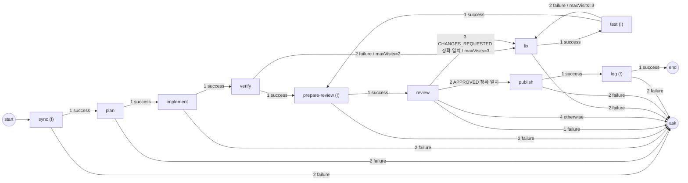

# aiflow — macOS용 Codex / Antigravity 그래프 기반 순차 실행 워크플로 러너 계획서

> GUI: Kotlin Multiplatform + Compose Multiplatform (UI 공통 모듈, Desktop/JVM 타깃)
> 실행: Codex CLI(`codex exec`) / Antigravity CLI(`agy`) 헤드리스 호출 + 셸 명령 단계(`!`)

---

## 0. 확정된 결정 사항

| 항목 | 결정 |
|---|---|
| 실행 방식 | Codex CLI / Antigravity CLI 헤드리스 호출. 데스크톱 앱 UI 자동화 없음 |
| GUI 역할 | 그래프 캔버스를 기본 편집 화면으로 사용. 노드 속성 및 화살표(조건·대상·우선순위) 편집, 실행·모니터링 |
| 실행 흐름 | 명시적 `start`와 `transitions`가 결정. 단계 목록 순서·노드 좌표·자동 배치는 실행에 영향 없음 |
| 저장·버전 | 미완성 그래프도 초안 저장. 검증을 통과한 그래프는 버전별 파일 보존, 이전 버전 복원 후 새 버전 생성 |
| 앱 재시작 | 미완료 런은 중단된 실행(INTERRUPTED)으로 기록. 자동 재개·재실행 없음 |
| 작업 성격 | 역할 분담형(계획·구현·검증·리뷰·수정 등). 각 단계는 선택한 agent에게 작업을 일임 |
| 단계 종류 | **agent 단계**(Codex/Antigravity 프롬프트) + **shell 단계**(`!`로 시작하는 셸 명령) |
| 대상 | 단일 Git 저장소, Git/GitHub 기반 동작 |
| 완료 판정 | 프로세스·출력 수신 완료 + 정상 종료코드 + provider 최종 성공 + 선택적 completion |
| 실패 처리 | 자격을 갖춘 실패만 같은 방문에서 자동 1회 재시도 → 최종 실패 전이. 세션 ID 미확보·준비 실패는 자동 재시도 생략 |
| 제어 | 수동 게이트 없음(전체 자동). "일시정지" = 현재 단계는 끝까지 실행·출력 수신, 다음 단계는 시작하지 않음 |
| 스크립트 수정 | 프롬프트/셸 스크립트 수정, 노드 추가/수정/삭제, 화살표 연결·분기 우선순위 변경 — 앱 내 그래프 에디터 |
| 기술 스택 | Kotlin Multiplatform + Compose Multiplatform. UI·엔진·어댑터는 공통 모듈, 프로세스 실행 등 OS 의존 부분만 JVM 모듈 |
| 권한·배포 | 본인 사용, 쓰기 권한 전면 허용(샌드박스 없음), 코드 서명 불필요 |
| 인증 | 사전 로그인 전제. 미로그인과 인증 확인 불가(Unknown)를 구분하여 차단·진단. 앱에서 로그인 지원 안 함 |
| 워크트리 결과 병합 | PR 생성 (agent 또는 shell 단계에서 `gh pr create`) |
| 워크트리 위치 | 저장소 옆 `../<repo>.worktrees/<name>` 기본, 사용자가 변경 가능 |
| 워크트리 처리 | 런 종료 후 유지, 히스토리 화면에서 수동 삭제 |
| 테스트·입력 | 앱이 개입하지 않음. 스크립트에 포함하면 agent가 직접 실행하거나 shell 단계로 사용자가 직접 명령 지정 |

---

## 1. 앱이 하는 것 / 하지 않는 것

| 앱이 하는 것 | 앱이 하지 않는 것 |
|---|---|
| 워크플로(단계 그래프) 편집·저장·검증 | 프롬프트 내용 가공·변수 치환 |
| 단계별 세션/워크스페이스/모델/사고수준/스크립트/전이 선택 UI | 단계 출력을 다음 단계 입력으로 자동 주입 |
| 워크트리 생성(`git worktree add`), 세션 ID 추적·resume | 이슈/요구사항 가져오기, PR 생성 (→ 프롬프트 또는 shell 단계로 사용자가 지시) |
| agent CLI / 셸 명령 순차 실행, 로그 스트리밍, 종료코드·completion 판정, 전이 평가 | 로그인, 워크트리 자동 삭제 |
| 1회 재시도 → 명시적 전이 평가 → 미매칭 시 사용자 확인, 일시정지, 루프 상한 | 병렬 실행 |

앱은 **"단계 = (세션 + 모델 + 사고수준 + 프롬프트) 또는 (워크스페이스 + 셸 명령)"을 전이 그래프 순서대로 실행하는 얇은 오케스트레이터**다. 실제 작업(테스트, 이슈 읽기, 커밋, PR 생성 등)은 프롬프트로 agent에게 일임하거나 shell 단계에 사용자가 직접 명령으로 적는다. 앱은 결과를 가공하지 않는다.

---

## 2. CLI 매핑 (Phase 0 검증 후보)

2026-10-05 부분 실측: `scripts/phase0-result.md` 및 `scripts/fixtures/phase0/` 참조.
Codex 앱 번들 0.160.0과 agy 1.2.16의 워크트리 new/resume은 VERIFIED다.
PATH의 Codex 0.146.0은 기본 gpt-6-astra와 호환되지 않았다. 나머지 기능까지 검증된 것은 아니다.
추가로 Manicule 독립 복제본에서 GitHub push·draft PR 생성/재사용·CI·정리,
agy 다른 cwd resume·중간 취소, Codex 미인증 exec·명시 모델을 검증했다.
agy 미인증 실패 계약은 별도의 로그아웃 환경이 없어 아직 NOT_VERIFIED다.

아래 명령·옵션·출력 이름은 실측 완료를 의미하지 않는다. 01에서 설치 버전의 도움말과 실제 실행으로 확정하고 차이를 본 절과 04에 함께 반영한다. 결과는 VERIFIED / UNSUPPORTED / NOT_VERIFIED로 구분한다. 필수 new·세션 ID·resume 계약 미검증 상태에서는 어댑터 완료로 간주하지 않는다. 필요한 기능/옵션이 미지원이면 오류로 표시하고 조용히 다른 동작으로 대체하지 않는다.

검증 산출물은 바이너리 버전, 실제 argv/stdin/cwd, CLI 자체 종료코드, stdout/stderr 원문, 출력·세션 ID 도착 시점, 최종 성공/실패 신호, 빈 출력 허용 여부다. 파이프라인의 tee 종료코드를 CLI 종료코드로 기록하지 않는다. 실측 원문을 파서 fixture로 사용하며, 잘린 JSON 등 synthetic 자료는 별도로 표시한다.

| 기능 | Codex | Antigravity |
|---|---|---|
| 새 세션 실행 | `codex exec --json -o <out.md> -C <dir> -m <model> -c model_reasoning_effort=<lvl> -c sandbox_mode=danger-full-access -c approval_policy=never -` (프롬프트 stdin) | `agy -p "<prompt>" --output-format json --model <slug> --effort <verified-effort> --dangerously-skip-permissions` (cwd = 작업 디렉토리) |
| 세션 ID 획득 | JSONL `thread.started` 이벤트의 `thread_id` | JSON 엔벨로프의 `conversation_id` |
| 세션 이어가기 | `codex exec --json -C <dir> -c ... resume <thread_id> -` | `agy -p ... --conversation <conversation_id>` |
| 모델/사고수준 | `-m`, `-c model_reasoning_effort=`. 버전·모델별 검증 필요 | `--model <slug>`, `--effort`. 1.2.16 help: low/medium/high/xhigh/max, 실제 성공 검증은 low. help 표기와 실행 지원 구분 |
| 결과 | `-o` 파일 + stdout 최종 메시지 | stdout JSON `response` |
| 실패 | `turn.failed` 이벤트 / 종료코드≠0 | 실측: JSON `status: ERROR`, `error`, 일반 stderr, 종료코드 1. 3/AGY_ERROR를 고정 계약으로 쓰지 않음 |
| 로그인 확인 | `codex login status` | `agy models` 성공 관찰. 미인증 판별 계약은 NOT_VERIFIED이므로 조회 실패만으로 로그아웃 판정 금지 |
| 모델 목록 | 설정에서 편집하는 후보 리스트. 목록 포함이 지원 보장을 의미하지 않음 | `agy models`의 탭 구분 `<slug>\t<label>` 출력. `--output-format json` 미지원 |

### 검증할 가정과 구현 원칙

- `codex exec ... -`는 stdin EOF를 기다림 → 프롬프트를 stdin으로 넣고 **반드시 close**. 미닫힘 실험에서 5초간 무출력 후 중단했으며 무한 대기 자체를 실측한 것은 아님.
- `codex exec resume`는 `--sandbox` 플래그 거부 → 항상 `-c sandbox_mode=` 형태로 통일.
- `agy --continue`는 "전역 최근 대화"라 워크트리 병행 시 혼선 → **항상 `--conversation <id>` 명시**.
- `agy -p`는 모델 슬러그가 틀리면 non-zero로 즉시 실패(조용한 폴백 없음) → 모델 목록은 `agy models`에서 동적으로 가져옴.
- macOS GUI 앱은 셸 PATH를 상속하지 않음 → 설정에서 바이너리 경로 지정 + `/bin/zsh -lc 'command -v codex'`로 자동 탐지. shell 단계도 같은 이유로 로그인 셸(`-lc`)로 실행.
- 빈 agent 출력의 허용 여부는 실제 출력 계약으로 확인. JSON 응답이 필수인 계약이면 빈/잘린 응답은 종료코드 0이어도 PROTOCOL_ERROR. shell은 빈 출력 허용.

---

## 3. 데이터 모델

```
Workflow
 ├─ name, repoPath, baseBranch
 ├─ worktreeRoot: "../<repo>.worktrees"      (설정에서 변경 가능)
 ├─ start: <step id>                           (필수, 그래프 시작 연결)
 ├─ maxSteps: 50                               (런 전체 방문 상한, 수동 Retry 포함·자동 retry 제외)
 ├─ sessions: { <name>: { provider: codex|antigravity, workspace: local | worktree:<name> } }
 ├─ worktrees[] : { name, branch }             (branch는 사용자가 직접 입력)
 ├─ editor?: { nodes: { <node id>: { x, y } } } (선택적 표시 메타데이터, 실행에서 무시)
 └─ steps[]                                   (저장용 목록, 배열 순서는 실행 의미 없음)
      ├─ id, title
      ├─ kind: agent (기본) | shell             ← script 첫 글자가 "!"이면 shell로 자동 해석
      │
      │  [agent 단계]
      ├─ session: { ref, mode: new | resume }
      ├─ model, effort
      ├─ script: 프롬프트 전문 (agent에게 그대로 전달)
      ├─ retryScript: 재시도 시 resume에 보낼 프롬프트 (기본값 제공, 수정 가능)
      │
      │  [shell 단계]
      ├─ workspace: local | worktree:<name>    (세션이 없으므로 직접 지정)
      ├─ script: "!" 뒤 셸 스크립트 (여러 줄 가능)
      │
      │  [공통]
      ├─ timeoutSec: N?                         (본문 실행·출력 수신, 시도별 선택 제한)
      ├─ checkTimeoutSec: 300                   (개별 completion/전이 조건 명령 제한, 초)
      ├─ completion: exitCode (기본) | fileExists:<path> | command:<cmd>     ← 선택
      └─ transitions[]                         (필수, 한 개 이상. 배열 순서 = 분기 평가 우선순위)
           ├─ when: success | failure | fileExists | fileContains | command | otherwise
           ├─ next: <step id> | end | ask
           ├─ maxVisits: N        (이 전이가 실행될 수 있는 횟수 상한)
           └─ resetSession: bool  (다음 agent 단계 진입 시 세션을 새로 시작)
```

### 규칙

**공통**
- **completion**은 단계 종료 후 앱이 확인만 하는 조건. 추가 조건 미지정 시에도 정상 프로세스 종료·출력 수신·provider 최종 성공 요건은 확인한다.
- **빈 스크립트**는 공백뿐인 원문과 `!` 해석 후 공백만 남는 셸 본문을 포함해 검증 오류다. 셸 접두는 첫 비공백 위치의 `!` 하나만 제거하며 나머지 공백·개행은 보존한다.
- **앞 단계 출력 자동 전달 없음**. 맥락 공유는 (a) 같은 세션 resume, (b) 파일로 남기고 다음 단계가 읽도록 지시 — 두 방식뿐. shell 단계 출력도 마찬가지로 `> FILE.md` 등으로 파일에 남겨야 agent가 읽을 수 있다.
- **명시적 시작과 연결**: 실행 가능한 그래프의 `start`는 실제 단계 id를 반드시 지정한다. 모든 단계는 `transitions`를 한 개 이상 갖고, 종료할 때도 `next: end`를 명시한다. 전이 생략/빈 목록은 버전 생성·실행 오류이지만 초안 저장은 허용한다. 인접 단계나 배열 마지막 위치에서 다음 단계·종료를 추론하지 않는다. 선형 템플릿도 모든 연결을 YAML에 생성한다.
- **단일 실행 정의**: 그래프 화살표와 속성 패널은 동일한 `start`/`steps[].transitions`를 편집한다. `steps` 배열 순서·보조 목록 정렬·노드 좌표·자동 배치는 실행 의미가 없다. `editor.nodes`는 단계 id 및 특수 노드 `start`/`end`/`ask`를 키로 한 좌표이며 생략 가능하다. 이 세 예약어는 단계 id로 사용할 수 없다.
- **전이 평가**: 각 단계의 `transitions` 배열에서 첫 매칭 하나만 선택한다(병렬 실행 없음). 우선순위를 화살표에 번호로 표시하고 전이 패널에서 변경하며, 노드 위치나 화살표 배치로 추론하지 않는다. `otherwise`는 최대 하나이며 마지막이어야 한다. `success`/`failure`는 본문·출력·provider·completion을 모두 반영한 최종 StepResult다. `fileExists`/`fileContains`/`command`는 해당 단계의 워크스페이스 기준으로 평가하며 성공·실패 여부와 무관하게 매칭 가능.
- **미매칭**: 일부 결과만 처리하는 전이는 경고 대상이며 실행 시 매칭이 없으면 `Ask("no transition matched")`로 안전 정지한다. 이는 암묵적 연결이 아니며 그래프에 누락 경고와 대기 사유로 표시한다. 의도한 확인 대기는 `next: ask` 화살표로 명시한다.
- **루프 보호**: 전이별 `maxVisits` + 런 전체 `maxSteps`. 초과 시 `AwaitingUser`로 전이.
- **재시도와 전이의 관계**: 자동 재시도 자격이 있으면 단계 내부 1회 재시도를 소진한다. 재시도가 불가능하거나 소진 후 실패하면 실패 결과로 동일한 전이 목록을 평가한다(`failure` 및 결과와 무관한 조건 포함). 매칭된 연결을 따르고 매칭이 없으면 Ask. 재시도는 같은 단계 내부 처리이며 새 그래프 연결을 만들지 않는다.
- **기존 형식**: 현재는 계획 단계이므로 암묵 전이 호환 모드나 자동 변환은 만들지 않는다. `start` 누락은 로드 오류, 전이 누락은 검증 오류로 안내하고 예시·템플릿을 모두 명시적 형식으로 작성한다.

### 초안·그래프 버전 저장

- `WorkflowDraft(workflowId, restoredFrom?, workflow)`와 `WorkflowVersion(workflowId, versionId, createdAt, restoredFrom?, workflow)`를 YAML 최상위 구조로 저장한다. workflowId/versionId는 UUID이며 표시 이름과 독립적이다. 버전에는 그래프·스크립트·노드 배치를 함께 담는다.
- 저장 경로는 `.aiflow/workflows/<workflowId>/draft.yaml`, `versions/<versionId>.yaml`. §4의 단독 Workflow YAML은 가져오기/내보내기 형식이다. 가져오기는 새 workflowId의 초안 생성 후 검증·버전 저장을 거친다.
- [저장]은 먼저 초안을 저장한다. 빈 start(`""`)·미연결 단계·빈 스크립트 등 검증 ERROR가 있어도 저장하고 다시 열 수 있다. ERROR가 없고 WARNING 확인을 마치면 실행 가능한 버전을 생성한다. WARNING 확인을 취소하면 초안만 유지한다. 파일시스템·로그인 등 현재 환경은 실행 전 프리플라이트에서 다시 확인한다.
- 버전 파일은 불변이다. 최신 버전과 내용이 같고 복원 작업이 아니면 중복 생성하지 않는다. 초안과 버전 쓰기는 임시 파일 완성 후 확정하며, 실패 시 기존 파일을 보존한다. 초안만 저장되고 버전 생성이 실패하면 해당 상태를 표시하고 실행하지 않는다.
- 이전 버전은 읽기 전용으로 열람하고 초안으로 복원할 수 있다. 복원 출처를 초안의 restoredFrom에 남기고, 이후 [저장] 시 새 versionId와 restoredFrom을 가진 버전을 만든다. 성공하면 초안의 복원 표시는 비운다. 원본·이후 버전·기존 런 참조를 덮어쓰지 않는다.
- 그래프 복원은 편집 정의·배치에만 적용하며 저장소 작업 파일·세션·런을 되돌리지 않는다. 실행은 사용자가 선택한 저장 버전만 사용한다. 잘못된 초안 대신 과거 버전을 몰래 실행하지 않는다.
- 이름 변경은 workflowId와 이력을 유지하고, 다른 이름으로 복제는 새 workflowId를 만든다. 런 기록 삭제는 그래프 버전에 영향이 없다. 워크플로 삭제는 초안·전체 버전 삭제 범위를 확인한 후 수행하며 실행 중인 워크플로는 삭제하지 않는다.

**agent 단계**
- **세션은 생성 시 워크스페이스에 고정**. `resume` 단계는 워크스페이스 선택이 잠기고 세션 것을 따른다. agy 실측에서는 다른 cwd에서 같은 ID를 재개해도 원래 워크트리에서 실행됐다. ID는 provider·정규화된 workspace와 결합하고 cwd 변경으로 세션을 이동시키지 않는다.
- NEW 방문은 해당 세션의 이전 활성 ID를 비우고 새로 생성한다. 루프 재진입도 동일하다. RESUME 방문은 기존 유효 ID가 필수이며, 없으면 CLI 실행 전 SESSION_MISSING으로 실패하고 NEW로 전환하지 않는다.
- 자동 재시도는 **같은 방문의 유효 세션 ID로 resume + retryScript**. new였던 단계도 이번 방문에서 받은 ID로만 resume한다. ID가 없으면 생략 사유를 기록하고 실패 전이로 진행한다. provider가 세션을 거부하면 활성 ID를 제거한다.
- 준비 실패·AUTH/CONFIG/SESSION_MISSING/SESSION_INVALID·취소는 자동 재시도 대상이 아니다. 본문이 시작된 실패 중 유효 ID가 있는 agent 또는 shell만 최대 한 번 자동 재시도한다.
- 수동 Retry는 원래 script로 새 방문을 만들고 직전 방문의 유효 모드를 유지한다(NEW는 새 세션, RESUME은 결합된 유효 ID). 자동 retry에서는 NEW 초기화를 반복하지 않고, 수동 RESUME은 활성 맵에서도 유효한 결합 ID만 사용한다. 자동 retry는 방문 수를 늘리지 않으며 수동 Retry는 maxSteps를 소모한다. 두 방식 모두 기존 기록·카운터를 지우지 않는다.
- **resetSession**: 루프를 돌면 세션이 계속 resume되어 문맥이 쌓인다(의도된 장점이자 비용). 특정 전이에서 재진입 시 새 세션으로 시작하고 싶으면 `resetSession: true`. 대상이 agent 단계일 때만 허용한다.

**shell 단계 (`!`)**
- Codex/Antigravity 대화형 CLI에서 `!git log`를 치면 셸 명령이 바로 실행되는 것과 같은 개념. 스크립트 첫 줄이 `!`로 시작하면 shell 단계(`kind: shell` 명시와 동일), `!`를 뗀 나머지 전체를 지정 워크스페이스(cwd)에서 `/bin/zsh -lc`로 실행.
- 세션·모델·effort 없음. 전이 그래프에서는 agent 단계와 동등한 **독립 노드**.
- 자동 재시도 자격이 있으면 같은 명령 1회 **rerun**, 그 후 최종 실패 전이 평가 → 매칭 없으면 Ask. 준비 실패·취소는 rerun하지 않는다.
- 로그인 셸(`-lc`)이라 사용자 PATH·`gh` 인증이 적용된다. 단 `.zshrc` 전용 alias/함수는 미적용(편집기에서 안내).
- stdout/stderr는 로그에 스트리밍·기록만 하고 다음 단계에 주입하지 않는다(앱 불개입 원칙).
- 샌드박스 없음(쓰기 전면 허용과 일관). `rm -rf`, `--force`, `git reset --hard` 등 위험 패턴은 편집기에서 경고 배지만 표시(차단 안 함).
- `completion: command`와의 차이: completion은 단계에 붙는 **확인 조건**, shell 단계는 자기 전이를 가진 **노드**. 예: `./gradlew test` 결과로 success→review / failure→fix 분기.

---

## 4. 워크플로 예시 (동기화 → 계획 → 구현 → 검증 → 리뷰 → 수정·테스트 루프 → PR → 로그)

모델/effort는 저비용 검증용 **후보 예시**다. GPT-6 Luna(`gpt-6-luna`)를 이번 Phase 0에서
실측한 것으로 간주하지 않으며, 실행 전 설치 CLI·계정의 지원 계약을 확인한다.
단순 프로토콜/작은 구현 검증은 아래처럼 low부터 시작하고, 복잡한 실제 작업에 필요한
상위 모델/effort는 선택 이유를 기록해 명시한다. 기존 사용자 그래프를 자동 치환하지 않는다.
검증 비용 원칙의 원본은 `00-overview.md`다. 셸·정적 검사·저장 fixture로 충분하면 모델을 호출하지 않는다.
GitHub 통합 테스트에서는 사용자 지정 저장소의 독립 복제본/전용 브랜치와 draft PR을 사용한다.
Phase 0의 수동 성공은 이후 앱의 end-to-end 완료를 대신하지 않는다.

```yaml
name: feature-dev
repoPath: /Users/me/src/myrepo
baseBranch: main
worktreeRoot: ../myrepo.worktrees
start: sync
maxSteps: 30

worktrees:
  - { name: impl-wt, branch: ai/feature-x }

sessions:
  plan: { provider: codex,       workspace: local }
  impl: { provider: antigravity, workspace: worktree:impl-wt }

steps:
  - id: sync                      # shell 단계: "!"로 자동 해석
    title: 기준 브랜치 동기화
    workspace: local
    script: |
      !set -eu
      git fetch origin
      git switch main
      git pull --ff-only
      git log --oneline -10 > GITLOG.md
    transitions:
      - { when: success, next: plan }
      - { when: failure, next: ask }

  - id: plan
    session: { ref: plan, mode: new }
    model: gpt-6-luna
    effort: low
    script: |
      GitHub 이슈 #123을 gh CLI로 읽고, 최근 변경(GITLOG.md)을 참고해
      구현 계획을 PLAN.md에 작성하라.
    completion: { fileExists: PLAN.md }
    transitions:
      - { when: success, next: implement }
      - { when: failure, next: ask }

  - id: implement
    session: { ref: impl, mode: new }
    model: gemini-3.8-flash-low
    effort: low
    script: |
      ../../myrepo/PLAN.md 를 읽고 계획대로 구현하라.
      테스트를 작성하고 ./gradlew test 가 통과할 때까지 수정하라.
      변경한 작업 파일을 커밋하여 ai/feature-x에 반영하라.
      보고서 파일은 커밋하지 말고, 작업 파일의 미커밋 변경을 남기지 마라.
    transitions:
      - { when: success, next: verify }
      - { when: failure, next: ask }

  - id: verify
    session: { ref: impl, mode: resume }
    model: gemini-3.8-flash-low
    effort: low
    script: |
      ./gradlew test 전체를 실행해 통과 여부를 확인하고 VERIFY.md에 결과를 요약하라.
      코드나 커밋은 변경하지 마라.
    checkTimeoutSec: 1800
    completion: { command: "./gradlew test" }
    transitions:
      - { when: success, next: prepare-review }
      - { when: failure, next: fix, maxVisits: 2 }

  - id: prepare-review             # shell: 커밋 고정 + 이전 리뷰 무효화
    kind: shell
    workspace: local
    timeoutSec: 30
    script: |
      !set -eu
      wt=../myrepo.worktrees/impl-wt
      dirty=$(git -C "$wt" status --porcelain)
      test -z "$dirty"
      head=$(git rev-parse ai/feature-x)
      base=$(git rev-parse main)
      test "$(git -C "$wt" rev-parse HEAD)" = "$head"
      printf '%s\n%s\n' "$head" "$base" > REVIEW_TARGET.txt
      : > REVIEW.md
    transitions:
      - { when: success, next: review }
      - { when: failure, next: ask }

  - id: review
    session: { ref: plan, mode: resume }
    model: gpt-6-luna
    effort: low
    checkTimeoutSec: 30
    script: |
      REVIEW_TARGET.txt의 첫 줄은 검토할 head SHA, 둘째 줄은 base SHA다.
      git diff <base SHA>..<head SHA> 를 PLAN.md 기준으로 리뷰하라.
      REVIEW.md를 이번 결과로 덮어써라. 첫 줄은 정확히 APPROVED 또는
      CHANGES_REQUESTED, 둘째 줄은 검토한 head SHA, 셋째 줄은 base SHA를 쓰고
      넷째 줄부터 근거와 수정 지시를 적어라. 코드나 커밋은 변경하지 마라.
    completion:
      command: |
        test -f REVIEW.md && test -f REVIEW_TARGET.txt || exit 1
        state=$(sed -n '1p' REVIEW.md) || exit 2
        case "$state" in APPROVED|CHANGES_REQUESTED) ;; *) exit 1 ;; esac
        head=$(sed -n '1p' REVIEW_TARGET.txt) || exit 2
        base=$(sed -n '2p' REVIEW_TARGET.txt) || exit 2
        test -n "$head" && test -n "$base" || exit 1
        test "$(sed -n '2p' REVIEW.md)" = "$head" || exit 1
        test "$(sed -n '3p' REVIEW.md)" = "$base" || exit 1
        current_head=$(git rev-parse ai/feature-x) || exit 2
        current_base=$(git rev-parse main) || exit 2
        test "$current_head" = "$head" && test "$current_base" = "$base" || exit 1
        wt=../myrepo.worktrees/impl-wt
        worktree_head=$(git -C "$wt" rev-parse HEAD) || exit 2
        dirty=$(git -C "$wt" status --porcelain) || exit 2
        test "$worktree_head" = "$head" && test -z "$dirty"
    transitions:
      - { when: failure, next: ask }
      - when:
          command: |
            state=$(sed -n '1p' REVIEW.md) || exit 2
            test "$state" = APPROVED
        next: publish
      - when:
          command: |
            state=$(sed -n '1p' REVIEW.md) || exit 2
            test "$state" = CHANGES_REQUESTED
        next: fix
        maxVisits: 3
      - { when: otherwise, next: ask }

  - id: fix
    session: { ref: impl, mode: resume }
    model: gemini-3.8-flash-low
    effort: low
    script: |
      VERIFY.md의 테스트 실패 또는 ../../myrepo/REVIEW.md의 수정 지시를 반영하라.
      REVIEW.md가 없거나 비어 있으면 검증 실패를 우선 확인하라.
      변경한 작업 파일을 커밋하고 미커밋 변경을 남기지 마라. 보고서는 커밋하지 마라.
    transitions:
      - { when: success, next: test }
      - { when: failure, next: ask }

  - id: test                      # shell 단계: agent 없이 테스트만 돌리고 분기
    kind: shell
    workspace: worktree:impl-wt
    timeoutSec: 1800
    script: |
      !./gradlew test
    transitions:
      - { when: success, next: prepare-review }
      - { when: failure, next: fix, maxVisits: 3 }

  - id: publish
    session: { ref: impl, mode: resume }
    model: gemini-3.8-flash-low
    effort: low
    script: |
      ../../myrepo/REVIEW.md 첫 줄이 정확히 APPROVED인지 확인하라.
      둘째/셋째 줄의 검토 SHA가 ../../myrepo/REVIEW_TARGET.txt의 head/base 및 현재 HEAD/main과
      모두 같은지 확인하고, git status --porcelain 결과가 비어 있는지도 확인하라.
      불일치하면 작업을 진행하지 말고 실패로 종료하라.
      gh api user로 사전 지정된 게시 계정인지 확인하고, git ls-remote로 현재 원격 main SHA가
      검토한 base SHA와 같은지도 확인하라. 불일치하면 실패로 종료하라.
      공유 gh 활성 계정을 자동 전환하거나 토큰을 파일·로그에 기록하지 마라.
      코드 수정이나 새 커밋 없이 승인된 HEAD만 origin의 ai/feature-x로 푸시하라.
      같은 head/base 브랜치의 열린 PR이 있으면 재사용하고, 없을 때만
      gh pr create --base main --head ai/feature-x --fill 로 PR을 생성하라.
    transitions:
      - { when: success, next: log }
      - { when: failure, next: ask }

  - id: log                       # shell 단계: 결과 확인
    workspace: worktree:impl-wt
    script: |
      !git log --oneline main..HEAD && gh pr view
    transitions:
      - { when: success, next: end }
      - { when: failure, next: ask }
```

### 실행 그래프



`(!)` 표시가 shell 단계. 나머지는 agent 단계. 화살표 번호는 출발 단계의 전이 평가 우선순위다. prepare-review는 깨끗한 워크트리의 검토 head/base SHA를 고정하고 이전 REVIEW.md를 비운다. review는 완료 확인에서 SHA·워크트리 상태를 검사하고 실패를 먼저 처리한다. 승인 분기는 첫 줄 정확 일치로만 결정한다. 상한 초과·조건 미매칭은 런타임 안전 정지로 표시하며 별도 저장 연결을 생성하지 않는다.

예시 실행 전 준비: 샘플 저장소에 origin·main·Git 작성자 정보·사용 가능한 테스트 명령을 준비한다. `PLAN.md`, `GITLOG.md`, `VERIFY.md`, `REVIEW.md`, `REVIEW_TARGET.txt`, `.aiflow/`는 샘플의 로컬 exclude에 등록하고 추적하지 않아 작업 코드의 clean 검사와 분리한다. 앱은 이를 임의로 변경하지 않으며 Phase 0/06의 fixture 준비에서 수행한다. 생성된 보고서 경로는 예시 전용으로 예약한다.

implement/fix에서 커밋하고 verify/review는 읽기·검증만 수행한다. publish는 승인된 커밋을 변경하지 않고 푸시·PR 생성/재사용만 한다. 검토 후 외부에서 브랜치를 수정하면 완료 확인 또는 publish 직전 재확인에서 실패해야 한다. 이는 예시 스크립트의 업무 규칙이며 엔진의 프롬프트 가공 기능이 아니다.

좌표는 위 예시처럼 생략할 수 있다. 편집기는 최초 자동 배치 후 필요하면 다음 메타데이터를 YAML 최상위에 저장한다. 좌표를 변경하거나 삭제해도 실행 경로는 같다.

```yaml
editor:
  nodes:
    start: { x: 0, y: 0 }
    sync: { x: 240, y: 0 }
    plan: { x: 480, y: 0 }
```

---

## 5. 어댑터 (단계 종류별 실행 방식)

| | Codex (agent) | Antigravity (agent) | Shell (`!`) |
|---|---|---|---|
| new | `codex exec --json -C <cwd> -m <model> -c model_reasoning_effort=<effort> -c sandbox_mode=danger-full-access -c approval_policy=never -` (script를 stdin으로, 반드시 close) | `agy -p "<script>" --output-format json --model <model> --effort <effort> --dangerously-skip-permissions` (cwd=<workspace>) | 단일 줄: `/bin/zsh -lc '<script>'`<br>여러 줄: 임시 파일 저장 후 `/bin/zsh -l <file>`<br>cwd=<workspace> |
| resume | `codex exec --json -C <cwd> -c ... resume <thread_id> -` | `agy -p ... --conversation <conversation_id>` | 해당 없음 (재시도 = rerun) |
| 세션 ID | JSONL `thread.started.thread_id` | JSON `conversation_id` | 없음 |
| 결과 | stdout 최종 메시지 / `-o` 파일 | stdout JSON `response` | stdout/stderr 원문 |
| 실패 | `turn.failed` / 종료코드≠0 | JSON `status: ERROR` / `error` / 종료코드≠0 (실측 1) | 종료코드≠0 / timeout |
| 로그인 확인 | `codex login status` | `agy models` 조회 가능 여부. 미인증과 기타 실패의 분류는 추가 검증 필요 | 해당 없음 |

agy 1.2.16 성공은 완성된 JSON의 `status == "SUCCESS"`와 종료코드 0을 함께 확인한다.
실측 stdout은 종료 부근에 단일 JSON으로 수신되며 `conversation_id`도 이 시점에 확보된다.
정상적인 빈 agent 결과 허용 여부는 NOT_VERIFIED이므로 shell의 빈 출력 허용과 혼동하지 않는다.
AuthStatus는 LoggedIn / LoggedOut / Unknown(detail) / NotApplicable을 구분한다.
네트워크·버전·옵션·응답 파싱 오류를 LoggedOut으로 바꾸지 않는다. Unknown은 원인 진단과 함께 실행 차단한다.
effort의 저장 표기는 LOW/MEDIUM/HIGH/XHIGH/MAX이며, 실제 실행 지원은 binary 버전·모델별
VerifiedCliContract에서 판단한다. 모델 목록과 도움말만으로 실제 성공을 보장하지 않는다.

**ProviderAdapter 인터페이스** (commonMain, 04와 동일 계약)

```kotlin
interface ProviderAdapter {
    val id: Provider? // shell은 null
    fun buildCommand(req: ExecRequest): ProcessSpec
    fun createParser(req: ExecRequest): ProviderParser
    suspend fun probeAuth(exec: ProcessExecutor, cfg: ProviderConfig): AuthStatus
    suspend fun listModels(exec: ProcessExecutor, cfg: ProviderConfig): List<String>?
}
interface ProviderParser {
    fun accept(line: String, stream: Stream): List<AgentEvent>
    fun finalizeOutput(exitCode: Int?, termination: Termination): ProviderReport
}
data class ExecRequest(val cwd: String, val script: String, val model: String?, val effort: Effort?,
                       val resumeSessionId: String?, val binaryPath: String, val scriptFilePath: String?)
enum class ProviderOutcome { SUCCEEDED, FAILED, PROTOCOL_ERROR, NOT_APPLICABLE }
enum class Termination { NORMAL, TIMED_OUT, CANCELLED, START_FAILED, OUTPUT_INCOMPLETE }
data class ProviderReport(val outcome: ProviderOutcome, val sessionId: String?,
                          val finalOutput: String?, val failure: FailureInfo?, val finalEvents: List<AgentEvent>)
// AgentEvent: SessionStarted, Message, ToolCall, Diagnostic, Raw, Completed, Failed
```

시도마다 새 파서를 만든다. accept는 스트리밍 이벤트를 반환하고, 프로세스 종료 및 stdout/stderr 수신 완료 후 finalizeOutput을 정확히 한 번 호출한다. finalEvents는 아직 방출하지 않은 이벤트만 포함한다. 세션 ID가 최종 JSON에서 나와도 런에 반영한 뒤 판정한다.

알려진 최종 실패는 FAILED, 요구된 출력의 누락/손상은 PROTOCOL_ERROR, 검증한 성공 계약 충족은 SUCCEEDED로 정규화한다. shell은 NOT_APPLICABLE이며 빈 출력도 허용한다. 일반 stderr/오류 문자열은 Diagnostic/Raw로 보존하며 작업 전체 실패와 구별한다. 명시적 실패를 뒤의 성공 이벤트나 completion으로 뒤집지 않는다. 어댑터는 순수 커맨드 빌드·출력 해석을 담당하며 프로세스·임시 파일·시간 제한은 엔진이 관리한다.

---

## 6. 실행 엔진

### 상태 머신

```
Run: Idle → Preflight → Running / PauseRequested → Paused → Running
     → AwaitingUser → 사용자 결정
     → Completed | Failed | Aborted | Interrupted

Visit: Preparing → Executing → Finalizing → Checking → 최종 결과
       → 재시도 자격 + attempt 1 실패: 동일 방문 attempt 2
       → 재시도 불가/소진 또는 성공: 명시적 전이 평가
       → NextStep | End | Ask (명시적 대기·미매칭·조건 오류·상한)
```

### 실행·판정

- **시작**: 선택한 저장 버전의 그래프 검증 → workflowId/versionId·불변 Workflow 스냅샷·PREFLIGHT 기록 → CLI 지원 계약/로그인/모델/경로/워크트리 프리플라이트. 실패는 FAILED, 성공은 RUNNING을 기록하고 명시적 start에서 시작한다. 초기 런 기록이 실패하면 프로세스를 시작하지 않는다. 실행 중 편집·버전 복원은 현재 런에 영향 없다.
- **Preparing**: 워크트리 ensure(기존 경로·브랜치 불일치면 오류), 방문의 유효 세션 모드 결정, NEW의 이전 ID 제거/RESUME ID 확인, shell 임시 파일 생성. 준비 실패는 본문을 실행하지 않고 원인을 기록한다.
- **Executing → Finalizing**: 시도별 parser와 로그를 준비하고 본문 stdout/stderr를 동시에 소비한다. 프로세스 종료와 두 스트림 수신 완료를 모두 기다린 뒤 finalizeOutput을 한 번 호출하고 finalEvents·세션 ID를 반영한다. 종료 후 스트림 미종결은 내부 drain 제한(기본 5초)으로 정리하고 OUTPUT_INCOMPLETE로 기록한다.
- **최종 성공 요건**: 취소/timeout/출력 오류 없이 NORMAL 종료, 종료코드 0, ProviderReport가 SUCCEEDED 또는 shell NOT_APPLICABLE, completion Met를 모두 만족해야 한다. exitCode가 없는 실패에 가짜 코드를 만들지 않는다. provider 실패/프로토콜 오류이면 completion을 실행하지 않는다.
- **Retry**: §3의 자격에 따라 최대 한 번, 동일 방문 attempt 2로 실행. ID 미확보 등 재시도 불가 사유도 기록한다. 수동 Retry는 새 visitNo·manualRetryOf를 만들고 원래 script로 시작하며 maxSteps를 적용한다.

### 검사·전이·제어

- **검사 결과**: Met / NotMet / Error를 구별한다. 없는 파일·내용 불일치는 NotMet, 접근/읽기 오류는 Error. FileExists의 `*`는 단일 디렉토리 항목 이름 매칭만 지원한다.
- **completion Command**: workspace에서 `/bin/zsh -lc`로 실행, 정상 종료 0은 Met, 정상 non-zero는 NotMet, 시작 실패/timeout/I/O 오류는 Error. NotMet/Error 모두 단계 실패이며 원인을 구별해 자동 재시도 자격을 적용한다.
- **전이 Command**: 0은 Met, 1은 NotMet, 2 이상/시작 실패/timeout/I/O 오류는 Error. 검사 자체 오류를 거짓으로 처리하지 않고 Ask로 정지한다. 조건 명령은 이 종료코드 계약을 따라 작성한다.
- **시간 제한**: timeoutSec은 시도별 본문 실행·출력 수신에 적용(미지정 시 본문 제한 없음), checkTimeoutSec(기본 300초)은 개별 completion/전이 명령에 적용한다. 준비 Git/프리플라이트 제어 명령은 기본 30초 제한.
- **Transition**: 저장된 transitions 순서의 첫 Met만 선택한다. 명시적 ask·미매칭·조건 Error·상한 초과 사유를 구분한다. 같은 방문에서 평가한 외부 조건 결과는 인덱스별로 보존하며 같은 조건을 대기/재개 때 다시 실행하지 않는다.
- **Skip**: 원래 StepResult는 보존하고 success 간주를 사용자 결정으로 별도 기록한다. success/failure만 바꾸어 전이 순서를 평가하며 이미 평가한 외부 조건은 캐시를 사용, 처음 도달한 조건만 한 번 실행한다. 오류가 남으면 Ask 유지. 조건 오류 캐시는 새 방문에서 초기화한다.
- **상한**: maxSteps는 방문 수(수동 Retry 포함, 자동 retry 제외), maxVisits는 실제 따라간 전이 횟수(end/ask 포함). 카운터가 상한 이상이면 다음 방문/해당 연결 실행 전에 Ask. End는 새 방문을 소모하지 않는다. 대기/재평가만으로 카운터를 증가시키거나 상한 뒤 다른 전이로 우회하지 않는다. 같은 방문에서 이미 취한 ask를 재선택해도 중복 계수하지 않는다.
- **일시정지 우선순위**: 제어 이벤트는 직렬 처리한다. 중지/앱 종료 요청이 먼저 확정되면 후속 실행 금지. 전이 결과 End는 COMPLETED, Ask는 AWAITING_USER, NextStep일 때만 pauseRequested를 적용해 PAUSED. End/Ask에서 pauseRequested를 해제하고, 재개는 저장된 NextStep을 실행한다.
- **중지**: ManagedProcessRunner가 본문·검사·Git·프리플라이트 프로세스를 등록/해제한다. 강제 중지는 모든 등록 프로세스에 killTreeAndWait·출력 정리를 적용한 뒤 ABORTED로 확정하며 재시도/전이를 실행하지 않는다. 취소를 일반 실패로 변환하지 않고 늦은 이벤트로 terminal 상태를 변경하지 않는다. 소유 프로세스 정리를 확인할 수 없으면 FAILED로 종료하고 추가 실행을 금지한다.
- **실측 취소·정리 오류**: agy의 exit 1 / `context canceled`만으로 사용자 취소·timeout을 추정하지 않고 runner 종료 사유를 보존한다. kill 권한 거부·정리 timeout에도 로그 flush와 관측 결과/정리 오류 저장을 시도하며, 정리 예외가 증거 저장 경로를 건너뛰거나 무제한 대기로 이어지지 않게 한다.

### 기록·재시작

- `.aiflow/runs/<runId>/run.json`에 버전 참조와 스냅샷, 방문/시도·세션·카운터·중단 정보를 기록한다. 프로세스 시작 전 및 상태 변경/세션 ID 수신/종료 시 원자적으로 갱신한다. 로그/상태 쓰기 실패는 새 명령 시작을 막고 런 FAILED로 처리한다.
- `visits/<visitNo>-<stepId>/visit.json`은 유효 모드·manualRetryOf·선택 전이·사용자 제어 기록을, `attempts/<attemptNo>/`는 실제 command/script·stdout/stderr·events·result를 보존한다. 자동 retry도 별도 디렉토리여서 최초 실패 원문이 사라지지 않는다.
- 시도에 binary 경로/버전·적용 계약 ID·요청 모델/effort 및 CLI가 제공한 usage를 보존한다. 검증 기록에는 모델 선택 이유와 호출 수도 남긴다. 미관측 실제 모델·종료코드·비용은 추정하지 않는다.
- completion 검사 자료는 시도 아래 `checks/completion/`, 전이 검사는 방문 아래 `checks/transitions/<index>/`, 준비/프리플라이트 명령은 각각 preparing/preflight 디렉토리에 보존한다. 저장 인덱스는 0 기반, UI 우선순위는 1 기반이다. 확정된 결과는 덮어쓰지 않고 활성 시도만 중단 상태로 마무리한다.
- 정상 앱 종료는 모든 소유 프로세스 종료·출력 정리·로그 flush 후 미완료 런을 INTERRUPTED로 기록한다. 재시작 후 저장소 소유권 잠금을 확보하고 이전 앱의 PREFLIGHT/RUNNING/PAUSE_REQUESTED/PAUSED/AWAITING_USER를 INTERRUPTED로 전환한다. 완료/실패/중지/중단된 런은 유지한다.
- 중단 사유·직전 상태·마지막 기록 시각·발견 시각을 보존하며 실제 종료 시각/종료코드는 추정하지 않는다. 복구는 멱등이고 CLI 실행/resume/전이를 호출하지 않는다. 외부 CLI의 생존 여부는 미확인으로 표시한다. 새 실행은 새 runId·초기 세션/카운터로 start부터 시작한다.
- 런 기록의 세션 ID로 터미널에서 수동 resume하는 것은 앱의 중단 런 재개와 별개다. 워크트리 삭제는 히스토리 화면의 명시 동작으로만 수행한다.

---

## 7. 아키텍처 & 디렉토리 (UI 공통 모듈)

```
aiflow/
├─ build.gradle.kts, settings.gradle.kts
├─ shared/                              # KMP 모듈 (compose 플러그인 적용)
│  ├─ commonMain/
│  │  ├─ model/      Workflow·Step(kind)·Session·Worktree·Transition·Completion·EditorLayout
│  │  │               (kotlinx.serialization + kaml)
│  │  ├─ provider/   ProviderAdapter, CodexAdapter, AntigravityAdapter, ShellAdapter
│  │  │               (커맨드 빌드·출력 파싱 — 순수 로직)
│  │  ├─ git/        worktree add/list/remove, status (ProcessExecutor 경유)
│  │  ├─ engine/     RunOrchestrator, StepRunner, CompletionChecker,
│  │  │               TransitionEvaluator(+방문 카운터), RetryPolicy, ManagedProcessRunner, CheckRunner
│  │  ├─ storage/    WorkflowStore(초안·불변 버전), 런 기록·RunRecovery, 앱 설정
│  │  ├─ platform/   expect/인터페이스
│  │  │     ProcessExecutor   start / stdout·stderr Flow / exitCode / killTreeAndWait / stdin write+close
│  │  │     FileSystem        read / write / exists / glob (okio로 대체 가능)
│  │  │     Notifier, PathDetector(로그인 셸 PATH 탐지), TempFiles
│  │  └─ ui/         화면 전부(편집·실행·히스토리·설정) + ViewModel
│  ├─ commonTest/    어댑터 커맨드 빌더·파서, 전이 평가, 상태 머신(fake ProcessExecutor)
│  └─ jvmMain/
│     └─ platform/   actual: ProcessBuilder 기반 ProcessExecutor(프로세스 트리 kill 포함),
│                    java.nio FileSystem, macOS 알림(osascript), `/bin/zsh -lc` PATH 탐지
└─ desktopApp/                          # JVM 진입점만
   └─ Main.kt (Window, 메뉴, 파일 다이얼로그), compose.desktop.application(dmg)
```

**원칙**
- 엔진·어댑터·git은 `ProcessExecutor` 인터페이스에만 의존. 실제 `ProcessBuilder`는 `jvmMain`에만 등장.
- 커맨드 빌드·파싱은 순수 함수라 `commonTest`에서 CLI 없이 검증.
- 현재 타깃은 JVM 하나라 expect/actual은 형식적. 추후 "엔진은 mac, iOS/Android는 원격 모니터링 UI"로 확장 시 `ui/`를 그대로 재사용 가능. 확장 계획이 없으면 expect/actual 대신 인터페이스 + DI로 충분.

---

## 8. GUI 화면 구성

### 8.1 워크플로 편집
- **중앙 그래프 캔버스(기본·필수)**: 단계 노드와 명시적 전이 화살표를 직접 편집한다. agent는 provider 아이콘, shell은 `!` 아이콘. 노드 선택·이동, 팬·줌·맞춤, 자동 배치를 지원한다. 접이식 보조 목록은 검색·선택·정렬용이며 실행 순번을 표시하지 않는다.
- **시작·종료·대기**: 특수 노드 start의 단일 출력은 `Workflow.start`와 동기화한다. end/ask는 입력만 받고 실행 단계가 아니다. 마지막 작업도 end에 명시적으로 연결한다.
- **화살표 편집**: 출력에서 대상 노드/end/ask로 드래그하거나 속성 패널의 대상으로 연결한다. 화살표를 선택해 조건·대상·우선순위·maxVisits·resetSession을 수정하고 재연결·삭제한다. 조건과 평가 우선순위 번호, 상한·리셋 배지를 화살표에 표시한다. 같은 대상의 복수 전이·자기 루프·역방향 연결도 지원한다.
- **편집 동작**: 추가·복제 노드는 연결 없이 생성한다. 노드 삭제 시 인접 전이와 시작 연결을 함께 제거하며 자동 우회 연결은 만들지 않는다. id 변경 시 시작·들어오는 전이·좌표 키를 함께 갱신한다. 관련 변경을 한 undo/redo 작업으로 처리한다.
- **배치와 실행 분리**: 좌표는 선택적 `editor.nodes`에 저장한다. 좌표 없는 YAML은 최초 자동 배치하며 일부 좌표만 없으면 기존 위치를 유지한다. 자동 배치는 강결합 요소를 묶은 DAG와 묶음 안 루프를 배치해 순환을 지원한다. 배치·노드 이동·보조 목록 정렬은 `start`와 `transitions`를 변경하지 않는다.
- **우측 선택 노드/화살표 속성 패널**
  - 상단 **[Agent | Shell] 토글**. 스크립트 첫 글자에 `!`를 입력하면 자동으로 Shell로 전환, 지우면 Agent로 복귀.
  - [Agent] 세션 선택(new/resume), 워크스페이스(세션 따라 자동 결정·resume 시 잠금), 모델·effort 드롭다운, 프롬프트 에디터, retryScript.
  - [Shell] 워크스페이스 드롭다운(local / 워크트리), 셸 하이라이팅 에디터. 세션·모델 영역 숨김. 위험 패턴(`rm -rf`, `--force`, `reset --hard`) 경고 배지. "`.zshrc` alias는 적용되지 않음" 안내.
  - [공통] timeoutSec(본문)·checkTimeoutSec(검사) 편집, completion 선택, **나가는 전이 섹션**: 조건(success/failure/fileExists/fileContains/command/otherwise) + 대상(단계 id/end/ask) + maxVisits + resetSession(agent 대상만) + 우선순위. 그래프와 동일한 전이 데이터를 편집하고 otherwise는 최대 하나·마지막으로 유지한다.
- **상단 탭**: 그래프(기본), 세션·워크트리 정의(이름·브랜치), 일반 설정(start·maxSteps·worktreeRoot). 빈 초안도 저장 가능하고 연결 완성 전 버전 생성·실행은 불가. 선형/예시 템플릿에는 시작·종료·실패 처리를 포함한 명시적 연결을 생성한다.
- **버전 기록**: 생성 시각·versionId·복원 출처를 표시하고 이전 그래프를 읽기 전용으로 열람하거나 초안으로 복원한다. 현재 초안 교체를 확인하고, 보존이 필요하면 단독 YAML로 내보낸 뒤 복원한다. 복원 후 저장은 새 버전 생성이며 기존 이력은 유지한다. 메모리 undo/redo와 별개로 앱 재시작 후에도 제공한다.
- **버전 생성·실행 검증**: 단계가 하나 이상, 실제 단계를 참조하는 start, 모든 단계의 비어 있지 않은 전이, 유효한 next, id 중복·예약어 금지, otherwise 위치·resetSession 대상 검사. 도달 불가·end 미도달·매칭 실패 가능성은 경고(`otherwise`도 없고 success/failure 모두를 포함하지도 않는 경우). resume 워크스페이스 불일치·잘못된 shell 워크스페이스·빈 스크립트는 오류. 세션 생성 경로 전무는 ERROR, 생성 경로 우회 가능은 WARNING이며 resetSession 진입도 생성 시도로 분석한다. 순환은 세션별 생성 이력 상태의 고정점 탐색으로 처리하고 실제 ID는 런타임에서 다시 확인한다. maxSteps/maxVisits/지정된 시간 제한은 양의 Int, 좌표는 유한 수, 조건 인자는 비어 있지 않아야 한다. step id·세션명·worktree명은 `[A-Za-z0-9][A-Za-z0-9_-]{0,63}`로 제한하고 표시 이름은 분리한다. 저장 ID는 앱 생성 값이며 worktree명은 해석된 root 안의 한 경로 요소로 검증한다. 오류가 있어도 초안 저장은 허용한다. 연결 누락/미매칭 경고를 노드와 이슈 패널에 표시하고 클릭 시 관련 노드/화살표로 이동한다. 안전 정지를 저장된 화살표처럼 그리지 않는다.

### 8.2 실행
- 프리플라이트 결과 체크리스트 → **단계 타임라인(방문 순서 기준, 같은 단계가 여러 번 나올 수 있음)**: 상태 색상·소요 시간·세션 ID·전이 결과 → 선택 단계 라이브 로그(agent: 이벤트 요약/원문 토글, shell: 터미널 원문 뷰) → [실행] [일시정지] [재개] [강제 중지].
- 타임라인은 실제 방문 기록이며 편집기의 단계 목록·좌표와 무관하다. 선택 전이의 우선순위·조건·대상을 실행 스냅샷 기준으로 표시한다.
- 실행 대상은 WorkflowStore의 저장 버전이며 초안은 제외한다. 선택한 버전과 프리플라이트 결과를 연결하고 버전 변경 시 재검사한다. INTERRUPTED는 기록 화면으로 표시하고 재개·재시도 없이 명시적 [새 실행]만 제공한다.
- 명시적 ask·미매칭·조건 오류·상한 초과와 자동 retry 생략 사유를 구분한다. [다시 시도]는 원래 script의 새 방문, [건너뛰기]는 기록 보존·외부 조건 캐시를 적용한 성공 간주, [중단]은 ABORTED. maxSteps 소진 시 다시 시도 비활성. 본문/검사 로그와 provider·exitCode·프로토콜 오류를 구별해 표시한다.

### 8.3 런 히스토리
- 과거 런 열람, 방문/시도별 원문·실제 전달 script·검사 결과·전이 판정 확인. 자동 retry는 같은 방문의 별도 시도, 수동 Retry는 manualRetryOf로 연결된 새 방문으로 표시한다. 원래 실패와 Skip 판정을 분리하고 세션 ID 복사·워크트리 수동 삭제를 제공한다.
- 사용한 그래프 버전 열람·초안 복원 연결, 중단된 실행의 직전 상태·사유·마지막 기록/발견 시각 표시. 원본 버전이 없어도 런 스냅샷을 열람하고 새 워크플로로 가져오기 가능.

### 8.4 설정
- CLI 경로(자동 탐지 버튼), Codex 모델 리스트 편집, Antigravity 모델 갱신, 기본 워크트리 루트, 알림(macOS 알림 센터).

---

## 9. 개발 단계

| Phase | 내용 | 완료 기준 |
|---|---|---|
| 0 | 두 CLI로 new→세션 ID→resume, 워크트리 cwd 동작, 에러 포맷, 로그인 셸 `-lc`에서 `gh` 인증 적용 확인 | 셸 스크립트로 예시 워크플로 수동 통과 |
| 1 | KMP 프로젝트 셋업, 모델·YAML·초안/버전 저장소, Codex/Antigravity/Shell 어댑터, `!` 해석 (03·04 병행 가능) | `commonTest` 통과 |
| 2 | 엔진: 순차 실행·스트리밍·completion·전이 평가·재시도·timeout kill·일시정지·버전별 런 기록·중단 기록 복구 | fake ProcessExecutor로 상태 머신·분기·루프·재시작 처리 테스트 |
| 3 | 실행 화면 + 실제 CLI 연결 + 프리플라이트 | 예시 워크플로 end-to-end 자동 실행(shell 분기 포함) |
| 4 | 그래프 기본 편집기: 노드·화살표 CRUD·분기 우선순위·루프 배치·초안/버전 저장·이전 버전 복원·속성·검증 | 초안 저장·버전 복원·실행, 재배치 후 실행 경로 동일 |
| 5 | 히스토리·설정·알림·dmg 패키징 | 설치형 앱 |

---

## 10. 리스크

- **CLI 플래그 변경**: 두 CLI 모두 활발히 변경 중. 어댑터 계층에 격리하고 Phase 0에서 실제 버전으로 재확인.
- **출력 누락·실패 오판**: 검증된 provider 계약과 최종 파싱으로 정상 출력·로그·최종 실패·프로토콜 오류를 구별하고 엔진 성공 요건에 포함한다.
- **세션 디렉토리 종속성**: 워크트리 삭제 후 세션 resume 불가 → 워크트리 정리는 수동 동작으로만.
- **shell 단계 환경 차이**: 로그인 셸(`-lc`)은 PATH·인증은 적용되나 `.zshrc` 전용 alias/함수는 미적용. 샌드박스가 없으므로 사용자 입력 명령은 그대로 실행됨(경고 배지만).
- **루프 폭주**: `maxVisits`·`maxSteps`로 상한. 세션 문맥 비대화는 `resetSession`으로 완화.
- **배치와 실행 혼동**: 시작 연결·화살표 조건·평가 우선순위를 항상 표시하고 목록/좌표 변경 전후의 실행 불변성을 테스트. 순환 그래프 배치는 강결합 요소로 처리하며 위상 정렬만으로 구현하지 않음.
- **동시 쓰기 충돌**: 순차 실행이라 `local`과 `worktree` 동시 쓰기 없음. 병렬 실행은 범위 밖.

---

## 11. 다음 산출물

1. Phase 0 검증 셸 스크립트: `scripts/verify-codex.sh`, `scripts/verify-agy.sh` (워크트리 cwd에서 new→ID→resume)
2. `shared/commonMain/model` Kotlin 데이터 클래스(필수 `start`·`transitions`, `Step.kind`, `Completion`, 선택적 `EditorLayout`) + §4 명시적 연결 YAML 로딩·검증 테스트
3. `CodexAdapter` / `AntigravityAdapter` 커맨드 빌더 + 파서 테스트
4. `TransitionEvaluator` + 방문 카운터 테스트(분기·루프·maxVisits·maxSteps, 목록/좌표와 실행 경로의 독립성)
5. `ShellAdapter` + 커맨드 빌더 테스트(단일 줄 `-lc`, 여러 줄 임시 파일, cwd=워크트리, timeout kill)
6. 그래프 기본 편집기 + 노드/화살표 편집·분기 우선순위·좌표 복원·undo/redo·초안/버전 복원 검증
7. WorkflowStore·RunRecovery + 버전 파일 불변성·재시작 후 중단 기록·자동 재실행 없음 검증

8. CLI 실측 계약·시도별 판정·세션/재시도·검사 취소·경로 검증·리뷰 SHA 회귀 테스트
